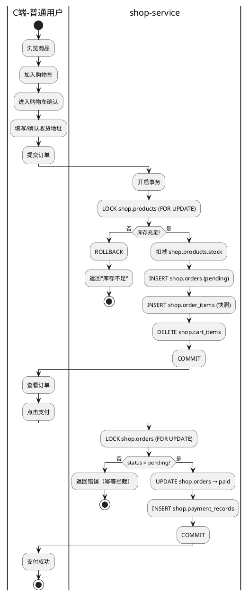
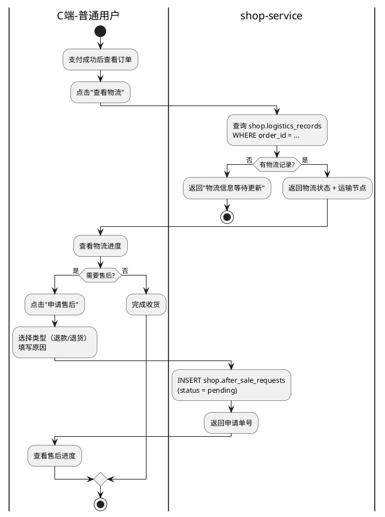
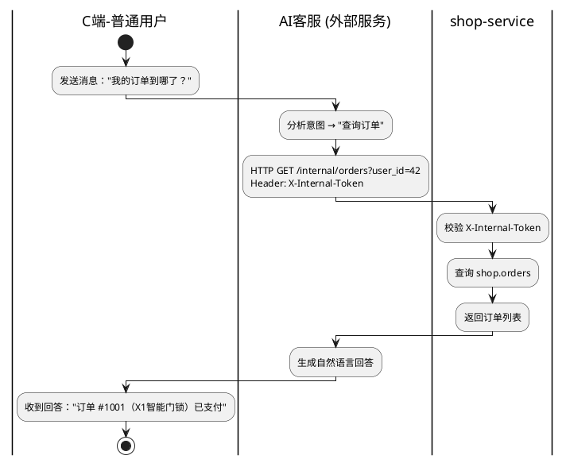
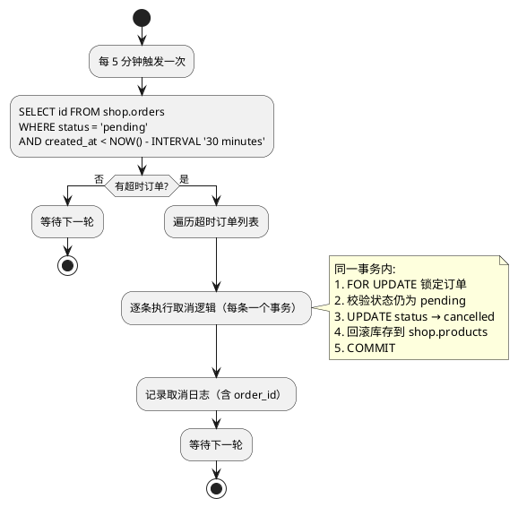
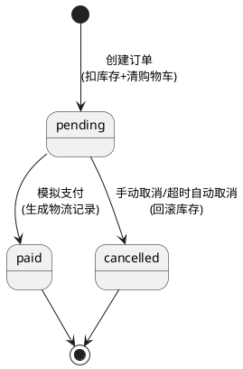
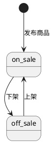
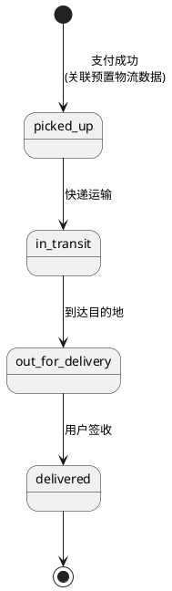
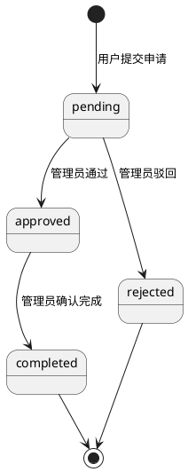

# 电商平台 需求设计文档

---

## 一、文档信息

- 文档名称：电商平台需求设计文档
- 文档版本：v5.4
- 编写日期：2026-05-31
- 编写人：需求分析团队
- 适用阶段：需求设计

> **v5.4 变更说明**：去除 AI 服务内部实现细节——AI 客服为外部独立项目，本文档仅关注电商业务需求及对外接口契约。保留 AI 客服作为系统角色的背景描述和电商服务需暴露的内部接口定义。

---

## 二、需求背景

### 2.1 项目背景

本项目是一个轻量级企业电商平台，覆盖用户注册、商品浏览、下单、模拟支付、物流追踪、售后处理的完整交易闭环。平台核心为**电商服务**（shop-service），通过 Nginx 统一入口，Docker Compose 一键部署。AI 客服作为外部协作服务（独立项目），通过内部接口与电商服务交互。

> **部署形态**：单机部署，Docker Compose 管理全部 4 个容器（nginx + shop + postgres + redis）。不考虑 K8s、多副本、服务网格等分布式场景。

### 2.2 现状与痛点

当前仅有一个 RAG 检索原型（AI 客服雏形），缺少完整的电商业务支撑。本项目填补电商业务空白，并预留内部接口供外部 AI 客服服务集成。

### 2.3 目标与价值

- 构建覆盖"用户 → 商品 → 订单 → 支付 → 物流 → 售后"的完整电商链路
- 预留内部接口供外部 AI 客服服务集成，展示服务间协作模式
- 在核心业务中融入并发控制、缓存策略、日志追踪、异常治理等生产级能力
- 通过 Docker Compose 实现全组件容器化部署，`docker compose up -d` 一键启动

---

## 三、范围说明

| 维度 | 本期范围（In Scope） | 本期不做（Out of Scope） |
| --- | --- | --- |
| **C端-用户** | 注册/登录（JWT）、浏览搜索商品、购物车、下单、模拟支付、物流追踪、售后申请与查询、订单查询与取消、AI客服咨询 | 手机验证码、第三方登录、头像上传、商品评价、商品收藏 |
| **B端-管理** | 商品分类管理、商品 CRUD 与上下架、查看所有订单 | SKU 多规格、库存预警、角色权限细分、操作审计日志 |
| **AI 客服** | FAQ 知识库检索、多轮对话、反问澄清、调用电商内部接口查询实时数据 | 情绪识别、转人工排队、主动推送、多语言支持 |
| **基础设施** | PostgreSQL + pgvector、Redis 缓存、Nginx 网关、Docker Compose 容器化、APScheduler 定时任务 | K8s 集群、CI/CD 流水线、监控告警（Prometheus/Grafana）、ELK 日志平台、读写分离、多级缓存 |
| **数据治理** | 数据库连接池、行级锁防超卖、日志+请求ID追踪、全局异常处理、B/C端 schema 独立 | 分布式事务、数据归档、审计日志 |
| **缓存** | Redis 热门商品列表缓存、商品详情缓存、分类树缓存 | 缓存预热、缓存穿透防护 |

---

## 四、用户角色

| 角色 | 描述 | 核心目标 | 权限/边界 |
| --- | --- | --- | --- |
| 普通用户 | 在平台购物的消费者 | 浏览商品、加入购物车、下单支付、查看物流、申请售后、查看自己的订单、咨询 AI 客服 | 仅操作自己的购物车和订单；浏览商品无需登录 |
| 管理员 | 平台运营方 | 管理商品分类、发布/编辑/上下架商品、查看全部订单 | 拥有商品模块全部写权限；不直接操作用户购物车和订单 |
| AI 客服 | 外部智能客服系统（独立项目） | 检索 FAQ 知识库、查询用户实时订单/物流/售后/商品数据、多轮对话 | 通过内部 API Token 调用电商服务查询接口；只读，不可修改电商数据 |
| 定时任务调度器 | 后台自动处理超时订单 | 定期扫描并取消超时未支付订单，回滚库存 | 仅操作 `pending` 状态且超过 30 分钟的订单 |

---

## 五、业务场景

### 5.1 C 端（普通用户）关键场景

**C 端**：用户注册登录 → 按分类浏览或关键词搜索商品 → 加入购物车 → 创建订单 → 模拟支付 → 查看物流 → 申请售后 → 查看订单。购物过程中可随时咨询 AI 客服。超时未支付的订单由系统自动取消并回滚库存。

| 场景编号 | 场景名称 | 触发条件 | 结果 | 优先级 |
| --- | --- | --- | --- | --- |
| SC1 | 用户注册 | 新用户访问平台，填写邮箱+密码+昵称 | 创建账号，密码 bcrypt 加密存储 | P0 |
| SC2 | 用户登录 | 已注册用户输入邮箱+密码 | 验证通过，签发 JWT Token（24h 有效） | P0 |
| SC3 | 浏览商品列表 | 用户进入首页或选择分类 | 展示上架商品列表（分页），热门分类优先从 Redis 读取 | P0 |
| SC4 | 关键词搜索 | 用户在搜索框输入关键词 | 返回名称匹配的商品列表 | P0 |
| SC5 | 查看商品详情 | 用户点击某商品 | 展示完整商品信息，优先从 Redis 读取 | P0 |
| SC6 | 加入购物车 | 用户点击"加入购物车" | 商品加入购物车；已存在则数量叠加 | P0 |
| SC7 | 管理购物车 | 用户进入购物车页面 | 修改数量、删除商品、查看合计金额 | P0 |
| SC8 | 创建订单 | 用户点击"结算"，确认收货地址 | 事务内：锁库存 → 扣减 → 生成 pending 订单 → 清空购物车 | P0 |
| SC9 | 模拟支付 | 用户在订单页点击"支付" | 订单状态 → paid，生成支付记录（幂等校验） | P0 |
| SC10 | 手动取消订单 | 用户取消 pending 状态订单 | 订单 → cancelled，库存自动回滚 | P0 |
| SC11 | 超时自动取消 | 订单创建超过 30 分钟仍为 pending | 定时任务自动取消，回滚库存 | P0 |
| SC12 | 查看订单列表 | 用户进入"我的订单" | 按时间倒序展示，支持按状态筛选 | P0 |
| SC13 | 查看订单详情 | 用户点击某订单 | 展示订单基本信息 + 商品明细 | P0 |
| SC14 | 查询物流追踪 | 用户在订单详情页查看物流 | 展示物流状态、当前位置、预计送达时间 | P0 |
| SC15 | 申请售后 | 用户对已支付订单发起退款/退货 | 创建售后申请单，返回申请状态 | P0 |
| SC16 | 查看售后进度 | 用户查看售后申请的处理进度 | 展示售后状态流转记录 | P0 |
| SC17 | 咨询 AI 客服（FAQ） | 用户在聊天窗口提问（如"怎么退款"） | AI 检索 FAQ 知识库返回答案 | P0 |
| SC18 | 咨询 AI 客服（查订单/物流/售后） | 用户问"我的订单到哪了""物流怎么样了" | AI 调用电商内部接口获取实时数据并回答 | P0 |

### 5.2 B 端（管理员）关键场景

**B 端**：管理员维护商品分类树 → 发布/编辑商品信息 → 控制商品上下架 → 查看平台全部订单。

| 场景编号 | 场景名称 | 触发条件 | 结果 | 优先级 |
| --- | --- | --- | --- | --- |
| SB1 | 管理员登录 | 管理员输入邮箱+密码 | 签发 JWT（role=admin），进入管理后台 | P0 |
| SB2 | 创建商品分类 | 管理员填写分类名称、父级分类（可选） | 新增分类节点，更新分类树缓存 | P0 |
| SB3 | 编辑/删除分类 | 管理员修改或删除分类 | 删除前检查商品引用，更新分类树缓存 | P0 |
| SB4 | 发布商品 | 管理员填写名称、描述、价格、图片URL、库存、分类 | 新增商品记录（status=on_sale），清除相关缓存 | P0 |
| SB5 | 编辑商品信息 | 管理员修改商品字段 | 更新商品记录，清除该商品缓存 | P0 |
| SB6 | 商品上下架 | 管理员切换商品 status | on_sale ↔ off_sale，清除相关缓存 | P0 |
| SB7 | 查看全部订单 | 管理员进入订单管理页 | 展示所有用户订单，支持按状态筛选 | P0 |

---

## 六、功能设计

### 6.1 功能概览

#### 6.1.1 C 端功能

| 功能模块 | 功能说明 | 优先级 | 所属服务 |
| --- | --- | --- | --- |
| 用户管理 | 注册、登录、JWT 签发、个人信息与地址维护 | P0 | shop-service |
| 商品浏览 | 分类浏览、关键词搜索、商品详情、分页 | P0 | shop-service |
| 购物车 | 添加/修改/删除/查看，UPSERT 幂等 [^1] | P0 | shop-service |
| 订单管理 | 下单（事务锁库存）、支付（幂等）、取消（回滚库存）、列表查询 | P0 | shop-service |
| 物流追踪 | 按订单查询物流状态、运输节点、预计送达 | P0 | shop-service |
| 售后处理 | 发起退款/退货申请、查看售后进度 | P0 | shop-service |
| AI 智能客服 | FAQ 检索与实时业务数据查询，详见外部 AI 服务项目文档 | P0 | 外部 ai-service |

[^1]: **UPSERT** = UPDATE + INSERT 的合写。在 PostgreSQL 中通过 `INSERT ... ON CONFLICT ... DO UPDATE` 实现：如果记录已存在则更新，不存在则插入。购物车场景中，同一用户重复添加同一商品时，自动合并为数量叠加，而非报错或产生重复行。

#### 6.1.2 B 端功能

| 功能模块 | 功能说明 | 优先级 | 所属服务 |
| --- | --- | --- | --- |
| 分类管理 | 二级分类树维护（增删改查） | P0 | shop-service |
| 商品管理 | 商品 CRUD、上下架 | P0 | shop-service |
| 订单查看 | 查看平台全部订单，按状态筛选 | P0 | shop-service |
| 售后审核 | 审核用户售后申请（通过/驳回/确认完成） | P1 | shop-service |

#### 6.1.3 系统级功能

| 功能模块 | 功能说明 | 优先级 | 所属服务 |
| --- | --- | --- | --- |
| 内部查询接口 | 电商服务提供商品/订单/物流/售后查询，供外部 AI 服务调用 | P0 | shop-service |
| 热门商品缓存 | Redis 缓存热门商品列表、商品详情、分类树 | P0 | shop-service |
| 超时订单自动取消 | APScheduler 定时扫描 pending 超 30 分钟的订单并取消 | P0 | shop-service |
| Nginx 网关 | 统一入口、路径路由、CORS、静态资源 | P0 | 基础设施 |
| Docker Compose 部署 | 全部服务容器化，一键启动 | P0 | 基础设施 |

### 6.2 C 端功能点描述

#### 6.2.1 用户注册 **[P0]**

- 使用角色：普通用户
- 功能目标：创建账号
- 前置条件：未登录
- 主处理逻辑：输入 email + password + nickname → 校验邮箱唯一性 → bcrypt 加密密码 → INSERT `shop.users` → 返回成功
- 关键规则：邮箱唯一（DB UNIQUE 约束 + 应用层校验）；密码 ≥ 6 位
- 异常说明：邮箱已存在 → "该邮箱已注册"

#### 6.2.2 用户登录 **[P0]**

- 使用角色：普通用户、管理员
- 功能目标：验证凭据，签发 JWT
- 前置条件：已注册
- 主处理逻辑：根据 email 查询 `shop.users` → bcrypt 比对密码 → 签发 JWT（payload: `user_id`, `email`, `role`, `exp`）
- 关键规则：Token 有效期 24h（`JWT_EXPIRATION_HOURS` 控制）；role 字段区分普通用户(user)和管理员(admin)
- 异常说明：邮箱或密码错误 → "邮箱或密码错误"

#### 6.2.3 商品浏览与搜索 **[P0]**

- 使用角色：普通用户（无需登录）
- 功能目标：按分类浏览或关键词搜索上架商品
- 前置条件：无
- 主处理逻辑：
  - 分类浏览 → 按 `category_id`（含子分类）筛选 `shop.products WHERE status='on_sale'` → 分页返回
  - 关键词搜索 → `WHERE name ILIKE '%keyword%' AND status='on_sale'` → 分页返回
  - 热门商品列表 → 优先从 Redis 读取，未命中则查 DB 并回写缓存
- 关键规则：普通用户仅见 `on_sale` 商品；分页默认每页 20 条
- 异常说明：空结果返回空列表

#### 6.2.4 商品详情 **[P0]**

- 使用角色：普通用户（无需登录）
- 功能目标：查看单个商品完整信息
- 前置条件：无
- 主处理逻辑：优先从 Redis 读取（key: `product:{id}`）→ 未命中则查 `shop.products` → 回写 Redis（TTL 10 分钟）
- 关键规则：下架商品对普通用户不可见
- 异常说明：商品不存在或已下架 → "商品不存在"

#### 6.2.5 购物车管理 **[P0]**

- 使用角色：普通用户
- 功能目标：管理待购商品
- 前置条件：已登录
- 主处理逻辑：
  - 添加：`INSERT INTO shop.cart_items ... ON CONFLICT (user_id, product_id) DO UPDATE SET quantity = quantity + EXCLUDED.quantity`
  - 修改：`UPDATE shop.cart_items SET quantity = %s`
  - 删除：`DELETE FROM shop.cart_items`
  - 查看：JOIN `shop.products` 获取商品名、价格、库存
- 关键规则：同用户同商品只保留一条；quantity 不可超商品 stock
- 异常说明：商品已下架 → "商品已下架，无法添加"

#### 6.2.6 创建订单 **[P0]**

- 使用角色：普通用户
- 功能目标：从购物车生成待支付订单
- 前置条件：已登录、购物车非空、已填写收货地址
- 主处理逻辑（**同一事务**）：
  1. `SELECT ... FROM shop.products WHERE id IN (...) FOR UPDATE` 锁定商品行
  2. 逐条校验库存（`stock >= quantity`），任一不足 → ROLLBACK
  3. `UPDATE shop.products SET stock = stock - quantity WHERE stock >= quantity`
  4. `INSERT INTO shop.orders (user_id, total_amount, address)` → status = pending
  5. `INSERT INTO shop.order_items`（快照 product_name, price）
  6. `DELETE FROM shop.cart_items WHERE user_id = ...`
  7. COMMIT
- 关键规则：全事务原子性；订单金额 = Σ(price × quantity)；订单明细快照防商品后续变更
- 异常说明：库存不足 → "商品 [xxx] 库存不足"

#### 6.2.7 模拟支付 **[P0]**

- 使用角色：普通用户
- 功能目标：完成支付
- 前置条件：订单状态为 pending
- 主处理逻辑：
  1. `SELECT ... FROM shop.orders WHERE id = ... FOR UPDATE` 锁定订单
  2. 校验归属（user_id）和状态（仅 pending）
  3. `UPDATE shop.orders SET status = 'paid', paid_at = NOW()`
  4. `INSERT INTO shop.payment_records (order_id, amount, method='mock')`
  5. COMMIT
- 关键规则：FOR UPDATE + 状态校验保证幂等
- 异常说明：已支付 → "请勿重复支付"；已取消 → "订单已取消"

#### 6.2.8 取消订单（手动）**[P0]**

- 使用角色：普通用户
- 功能目标：取消待支付订单，回滚库存
- 前置条件：订单状态为 pending
- 主处理逻辑（**同一事务**）：
  1. `SELECT ... FROM shop.orders WHERE id = ... FOR UPDATE` 锁定订单
  2. 校验归属和状态
  3. `UPDATE shop.orders SET status = 'cancelled', cancelled_at = NOW()`
  4. 逐条 `UPDATE shop.products SET stock = stock + quantity`（按 order_items 回滚）
  5. COMMIT
- 关键规则：库存回滚用 SQL 原子加法；已支付订单不可取消
- 异常说明：已支付 → "订单已支付，不可取消"

#### 6.2.9 订单列表与详情 **[P0]**

- 使用角色：普通用户
- 功能目标：查看自己的订单
- 前置条件：已登录
- 主处理逻辑：
  - 列表：`SELECT FROM shop.orders WHERE user_id = ... ORDER BY created_at DESC`，支持 `?status=pending` 筛选
  - 详情：订单基本信息 + `JOIN shop.order_items` 获取明细
- 关键规则：仅返回当前用户的订单
- 异常说明：无权限查看他人订单 → "订单不存在"

#### 6.2.10 物流追踪 **[P0]**

- 使用角色：普通用户
- 功能目标：按订单查询物流状态
- 前置条件：已登录，订单状态为 paid
- 主处理逻辑：
  1. 根据 order_id 查询 `shop.logistics_records` → 返回物流状态、当前位置、运输节点列表、预计送达时间
  2. 若订单尚无物流记录，返回"物流信息等待更新"
- 关键规则：仅查询当前用户的订单物流
- 异常说明：订单不存在 → "订单不存在"

#### 6.2.11 售后申请与查询 **[P0]**

- 使用角色：普通用户
- 功能目标：发起退款/退货申请，查看售后进度
- 前置条件：已登录，订单状态为 paid
- 主处理逻辑：
  - 申请：`INSERT INTO shop.after_sale_requests (user_id, order_id, type, reason)` → 返回申请单号
  - 查询：`SELECT FROM shop.after_sale_requests WHERE user_id = ... ORDER BY created_at DESC`
- 关键规则：同一订单可发起多次售后（不同原因）；仅查询当前用户的售后申请
- 异常说明：订单不存在或非本人 → "订单不存在"

#### 6.2.12 AI 客服对话 **[P0]**

> ⚠️ **跨服务说明**：本功能由外部 AI 客服服务（独立项目）实现，非本文档范围内需开发的功能。此处仅列出电商侧需配合暴露的内部接口，供 AI 服务调用时参考。

- 使用角色：普通用户、AI 客服
- 功能目标：FAQ 检索 + 实时业务数据查询
- 前置条件：用户已登录（获取 user_id）
- 主处理逻辑：
  - FAQ 类问题：AI 服务检索知识库返回答案
  - 实时数据类问题（订单/物流/售后/商品）：AI 服务调用电商内部接口获取数据后生成自然语言回答
  - 意图模糊时反问澄清，不强行猜测
  - 电商侧暴露以下内部接口供 AI 服务调用：

| 内部接口 | 用途 | HTTP 端点 | 调用方 |
| --- | --- | --- | --- |
| 订单查询 | 查询用户订单 | `GET /internal/orders?user_id=...` | AI 客服 |
| 物流查询 | 查询订单物流 | `GET /internal/logistics?order_id=...` | AI 客服 |
| 售后查询 | 查询售后进度 | `GET /internal/after-sales?user_id=...` | AI 客服 |
| 商品查询 | 搜索商品信息 | `GET /internal/products/search?keyword=...` | AI 客服 |
| 用户查询 | 获取用户信息 | `GET /internal/users/{user_id}` | AI 客服 |

- 关键规则：AI 不直连数据库，所有业务数据通过电商内部接口获取；接口通过 `X-Internal-Token` 认证
- 异常说明：内部接口超时 → AI 服务回退到纯 FAQ 回答

### 6.3 B 端功能点描述

#### 6.3.1 分类管理 **[P0]**

- 使用角色：管理员
- 功能目标：维护商品分类树
- 前置条件：管理员已登录
- 主处理逻辑：
  - 创建：`INSERT INTO shop.categories (name, parent_id)` → 清除分类缓存
  - 编辑：`UPDATE shop.categories` → 清除分类缓存
  - 删除：检查是否有商品引用 → 无引用则 DELETE → 清除分类缓存
- 关键规则：parent_id 为 NULL 表示一级分类，非 NULL 为二级；删除前检查 `shop.products` 中无引用
- 异常说明：有关联商品 → "该分类下有商品，无法删除"

#### 6.3.2 商品管理 **[P0]**

- 使用角色：管理员
- 功能目标：管理平台商品
- 前置条件：管理员已登录
- 主处理逻辑：
  - 发布：`INSERT INTO shop.products` → 清除热门商品列表缓存（`hot:products:list`）
  - 编辑：`UPDATE shop.products` → 清除该商品缓存（`product:{id}`）及热门商品列表缓存（`hot:products:list`）
  - 上下架：`UPDATE status = 'on_sale'/'off_sale'` → 清除该商品缓存及热门商品列表缓存
- 关键规则：下架不影响已有订单（订单明细是快照）；发布/编辑/上下架后必须清理受影响的 Redis 缓存
- 异常说明：分类不存在 → "请先选择有效分类"

#### 6.3.3 查看全部订单 **[P0]**

- 使用角色：管理员
- 功能目标：查看平台所有订单
- 前置条件：管理员已登录
- 主处理逻辑：`SELECT FROM shop.orders ORDER BY created_at DESC`，支持按状态筛选
- 关键规则：管理员可查看所有用户订单，但不可修改
- 异常说明：—

---

## 七、用例图设计

> 以下用表格描述用例关系。如需生成可视化 UML 图，可将表格数据导入 PlantUML、Draw.io 等工具自动渲染。

| 用例编号 | 用例名称 | 使用角色 | 所属模块 | 说明 | 优先级 |
| --- | --- | --- | --- | --- | --- |
| UC1 | 注册/登录 | 普通用户、管理员 | shop（C端） | 邮箱+密码注册，JWT 登录认证 | P0 |
| UC2 | 浏览搜索商品 | 普通用户 | shop（B端数据，C端读取） | 分类浏览 + 关键词搜索 + Redis 缓存 | P0 |
| UC3 | 管理购物车 | 普通用户 | shop（C端） | 添加/修改/删除购物车商品 | P0 |
| UC4 | 创建订单 | 普通用户 | shop（跨表操作） | 事务锁库存 → 创订单 → 清购物车 | P0 |
| UC5 | 模拟支付 | 普通用户 | shop（C端） | 支付幂等校验，生成支付记录 | P0 |
| UC6 | 取消订单 | 普通用户 | shop（跨表操作） | 回滚库存，仅 pending 可取消 | P0 |
| UC7 | 查看订单 | 普通用户 | shop（C端） | 按状态筛选、时间倒序 | P0 |
| UC8 | 物流追踪 | 普通用户 | shop（C端） | 按订单查询物流状态与运输节点 | P0 |
| UC9 | 售后申请与查询 | 普通用户 | shop（C端） | 发起退款/退货，查看售后进度 | P0 |
| UC10 | 分类管理 | 管理员 | shop（B端） | 二级分类树增删改，删除时清缓存 | P0 |
| UC11 | 商品管理 | 管理员 | shop（B端） | 商品 CRUD + 上下架，清理 Redis 缓存 | P0 |
| UC12 | 查看全部订单 | 管理员 | shop（C端数据，B端查看） | 跨用户查看，只读 | P0 |
| UC13 | FAQ 检索对话 | 普通用户、AI客服 | ai-service（外部） | 检索 FAQ 知识库返回答案 | P0 |
| UC14 | 查询实时订单 | AI客服（调用电商） | ai→shop 内部接口 | `GET /internal/orders` | P0 |
| UC15 | 查询物流信息 | AI客服（调用电商） | ai→shop 内部接口 | `GET /internal/logistics` | P0 |
| UC16 | 查询售后进度 | AI客服（调用电商） | ai→shop 内部接口 | `GET /internal/after-sales` | P0 |
| UC17 | 查询商品信息 | AI客服（调用电商） | ai→shop 内部接口 | `GET /internal/products` | P0 |
| UC18 | 超时订单自动取消 | 定时任务调度器 | shop | APScheduler 每 5 分钟扫描 | P0 |

---

## 八、业务流程图设计

> 以下流程使用 PlantUML 描述（文字即图表的标记语言）。安装 VS Code PlantUML 插件或使用 [PlantUML Online](https://www.plantuml.com/plantuml/) 粘贴代码即可渲染为可视化流程图。每个流程下方附有文字版步骤说明。

### 8.1 C 端：用户下单主流程

**文字步骤说明：**

1. 用户浏览商品 → 加入购物车 → 确认地址 → 提交订单
2. shop-service 开启事务 → `FOR UPDATE` 锁定库存 → 校验库存充足 → 扣减库存 → 创建 pending 订单 + 明细快照 → 清空购物车 → 提交事务（库存不足则回滚）
3. 用户查看订单 → 点击支付
4. shop-service `FOR UPDATE` 锁定订单 → 校验 status = pending → 更新为 paid → 写入支付记录 → 提交（非 pending 则拒绝）

**PlantUML 流程图：**



### 8.2 C 端：物流追踪与售后流程

**文字步骤说明：**

1. 用户支付成功后 → 订单状态变为 paid
2. 系统自动关联预置的物流演示数据 → 用户可查询物流进度
3. 用户对已完成订单不满意 → 发起售后申请（退款/退货）
4. 系统创建售后申请单（状态：待处理）→ 用户可查询售后进度

**PlantUML 流程图：**



### 8.3 C 端：AI 客服调用内部接口

**文字步骤说明：**

1. 用户发送消息（如"我的订单到哪了？"）
2. 外部 AI 客服服务分析意图为"查询订单"
3. AI 服务调用 `GET /internal/orders?user_id=42`（Header: X-Internal-Token）
4. shop-service 校验 Token → 查 shop.orders → 返回订单列表
5. AI 服务生成自然语言回答返回用户

> 注：AI 客服服务的内部架构（意图识别、对话管理、FAQ 检索等）由外部 AI 项目独立设计，本电商文档仅关注电商侧需暴露的内部接口。

**PlantUML 流程图：**



### 8.4 B 端：管理员商品管理流程

**文字步骤说明：**

1. 管理员登录（role=admin）→ 进入管理后台
2. 分类管理操作 → 创建/编辑/删除分类 → **删除 Redis key: `categories:tree`**
3. 发布商品 → INSERT shop.products → **删除 Redis key: `hot:products:list`**
4. 编辑/上下架商品 → UPDATE shop.products → **删除 Redis key: `product:{id}` + `hot:products:list`**

**PlantUML 流程图：**

```plantuml
@startuml
|B端-管理员|
start
:登录（role=admin）;
:进入管理后台;

if (操作类型?) then (分类管理)
  :创建/编辑分类;
  :清除分类树 Redis 缓存;
else (发布商品)
  :填写商品信息;
  :INSERT shop.products;
  :清除热门商品列表缓存;
else (编辑/上下架商品)
  :修改商品信息或状态;
  :UPDATE shop.products;
  :清除 product:{id} 缓存;
  :清除热门商品列表缓存;
endif

stop
@enduml
```

### 8.5 系统：超时订单自动取消流程

**文字步骤说明：**

1. APScheduler 每 5 分钟触发一次
2. 查询 `shop.orders WHERE status='pending' AND created_at < NOW() - INTERVAL '30 minutes'`
3. 无超时订单 → 等待下一轮
4. 有超时订单 → 逐条处理（每条独立事务）：`FOR UPDATE` 锁定 → 二次校验 status 仍为 pending → 更新为 cancelled → 回滚库存到 shop.products → COMMIT
5. 记录取消日志（含 order_id）

**PlantUML 流程图：**



---

## 九、核心业务对象

### 9.1 数据库 Schema 总览

B 端和 C 端表单共用同一 schema。数据库共 2 个 schema：

| Schema | 面向端 | 所属服务 | 说明 |
| --- | --- | --- | --- |
| `shop` | B 端 + C 端 | shop-service | 商品分类、商品、用户、购物车、订单、订单明细、支付记录、物流记录、售后申请 |
| `customer_service` | AI 客服 | 外部 ai-service | FAQ 向量、会话、消息 |

> **设计要点**：`shop.users` 中的 `role` 字段区分普通用户(user)和管理员(admin)，B/C 端权限隔离在应用层通过 JWT role 实现。下单时在同一 schema 内操作：从 `shop.products` 读取并锁定库存，写入 `shop.orders`。

### 9.2 C 端对象

| 对象名称 | 表名 | 描述 | 关键字段 | 备注 |
| --- | --- | --- | --- | --- |
| 用户 | shop.users | 平台注册用户 | id, email, password(bcrypt), nickname, role, address | role 区分 user/admin |
| 购物车项 | shop.cart_items | 用户待购商品 | id, user_id, product_id, quantity | UNIQUE(user_id, product_id) |
| 订单 | shop.orders | 用户订单 | id, user_id, total_amount, status, address, created_at, paid_at, cancelled_at | status: pending/paid/cancelled（详见第十章） |
| 订单明细 | shop.order_items | 订单商品快照 | id, order_id, product_id, product_name, price, quantity | 快照防商品信息变更 |
| 支付记录 | shop.payment_records | 支付流水 | id, order_id, amount, method | method 固定 mock |
| 物流记录 | shop.logistics_records | 订单物流追踪 | id, order_id, tracking_number, carrier, status, current_location, estimated_delivery, timeline(JSONB) | status 流转详见第十章 |
| 售后申请 | shop.after_sale_requests | 退款/退货/换货申请 | id, user_id, order_id, type, reason, status, created_at, updated_at | type/status 详见第十章 |

### 9.3 B 端对象

| 对象名称 | 表名 | 描述 | 关键字段 | 备注 |
| --- | --- | --- | --- | --- |
| 分类 | shop.categories | 商品分类（二级） | id, name, parent_id, sort_order | 树形结构 |
| 商品 | shop.products | 可售商品 | id, name, description, price, image_url, stock, category_id, status | status: on_sale/off_sale（详见第十章） |

### 9.4 AI 客服对象（customer_service schema）—— 供外部 AI 服务使用

| 对象名称 | 表名 | 描述 | 关键字段 | 备注 |
| --- | --- | --- | --- | --- |
| FAQ 向量 | customer_service.faq_embeddings | FAQ 问答对向量 | id, question, answer, embedding(1024维), metadata | pgvector HNSW 索引 |
| 会话 | customer_service.conversations | 用户对话会话 | id(UUID), user_id, title, status | status: active/closed（详见第十章） |
| 消息 | customer_service.messages | 对话消息记录 | id, conversation_id, role, content, turn_number | role: user/assistant/system |

### 9.5 Redis 缓存对象

| 缓存 Key | 内容 | 来源表 | TTL | 失效时机 |
| --- | --- | --- | --- | --- |
| `hot:products:list` | 热门商品列表 JSON（前 5 条 on_sale 商品，按创建时间倒序） | shop.products | 5 分钟 | 商品发布/编辑/上下架时删除 |
| `product:{id}` | 单商品详情 JSON | shop.products | 10 分钟 | 该商品编辑/上下架时删除 |
| `categories:tree` | 分类树 JSON（含两级） | shop.categories | 30 分钟 | 分类增删改时删除 |

> **缓存策略**：采用 **Cache-Aside** 模式。读：先查 Redis → 命中返回 → 未命中查 DB → 回写 Redis。写：先更新 DB → 再删除相关 Redis key（不更新缓存，由下次读触发回写）。
>
> **设计决策**（已确认）：
> - **更新粒度**：整体 key 删除，不做部分更新。热门列表仅 5 条，整体重建代价可忽略。
> - **并发竞态**：单次删除即可，不引入延迟双删。DB 事务（`FOR UPDATE`）在下单时做最终校验，缓存不一致仅导致短暂展示偏差，TTL 自动过期兜底。
> - **批量失效**：接口接受 id 列表，使用 Redis Pipeline 合并发送（单次网络往返），单个操作传入单元素列表即退化为批量特例。

### 9.6 完整建表 SQL

```sql
-- 启用 pgvector 扩展
CREATE EXTENSION IF NOT EXISTS vector;

-- ============================================
-- shop schema（电商服务全部表单）
-- ============================================
CREATE SCHEMA IF NOT EXISTS shop;

CREATE TABLE shop.categories (
    id          SERIAL PRIMARY KEY,
    name        VARCHAR(100) NOT NULL,
    parent_id   INTEGER REFERENCES shop.categories(id),
    sort_order  INTEGER DEFAULT 0,
    created_at  TIMESTAMPTZ DEFAULT NOW()
);

CREATE TABLE shop.products (
    id          SERIAL PRIMARY KEY,
    name        VARCHAR(255) NOT NULL,
    description TEXT,
    price       DECIMAL(10,2) NOT NULL,
    image_url   VARCHAR(500),
    stock       INTEGER NOT NULL DEFAULT 0 CHECK(stock >= 0),
    category_id INTEGER NOT NULL REFERENCES shop.categories(id),
    status      VARCHAR(20) DEFAULT 'on_sale',
    created_at  TIMESTAMPTZ DEFAULT NOW(),
    updated_at  TIMESTAMPTZ DEFAULT NOW()
);

CREATE INDEX idx_products_category ON shop.products(category_id);
CREATE INDEX idx_products_status  ON shop.products(status);

CREATE TABLE shop.users (
    id          SERIAL PRIMARY KEY,
    email       VARCHAR(255) NOT NULL UNIQUE,
    password    VARCHAR(255) NOT NULL,
    nickname    VARCHAR(100),
    role        VARCHAR(20) DEFAULT 'user',
    address     TEXT,
    created_at  TIMESTAMPTZ DEFAULT NOW(),
    updated_at  TIMESTAMPTZ DEFAULT NOW()
);

CREATE TABLE shop.cart_items (
    id          SERIAL PRIMARY KEY,
    user_id     INTEGER NOT NULL REFERENCES shop.users(id),
    product_id  INTEGER NOT NULL REFERENCES shop.products(id),
    quantity    INTEGER NOT NULL DEFAULT 1 CHECK(quantity > 0),
    created_at  TIMESTAMPTZ DEFAULT NOW(),
    UNIQUE(user_id, product_id)
);

CREATE TABLE shop.orders (
    id              SERIAL PRIMARY KEY,
    user_id         INTEGER NOT NULL REFERENCES shop.users(id),
    total_amount    DECIMAL(10,2) NOT NULL,
    status          VARCHAR(20) DEFAULT 'pending',
    address         TEXT NOT NULL,
    created_at      TIMESTAMPTZ DEFAULT NOW(),
    paid_at         TIMESTAMPTZ,
    cancelled_at    TIMESTAMPTZ
);

CREATE INDEX idx_orders_user   ON shop.orders(user_id);
CREATE INDEX idx_orders_status ON shop.orders(status);
-- 定时任务用的复合索引：快速找到超时 pending 订单
CREATE INDEX idx_orders_pending_time ON shop.orders(created_at) WHERE status = 'pending';

CREATE TABLE shop.order_items (
    id            SERIAL PRIMARY KEY,
    order_id      INTEGER NOT NULL REFERENCES shop.orders(id),
    product_id    INTEGER NOT NULL,
    product_name  VARCHAR(255) NOT NULL,
    price         DECIMAL(10,2) NOT NULL,
    quantity      INTEGER NOT NULL,
    created_at    TIMESTAMPTZ DEFAULT NOW()
);

CREATE TABLE shop.payment_records (
    id          SERIAL PRIMARY KEY,
    order_id    INTEGER NOT NULL REFERENCES shop.orders(id),
    amount      DECIMAL(10,2) NOT NULL,
    method      VARCHAR(50) DEFAULT 'mock',
    status      VARCHAR(20) DEFAULT 'success',
    created_at  TIMESTAMPTZ DEFAULT NOW()
);

-- 物流追踪表
CREATE TABLE shop.logistics_records (
    id                  SERIAL PRIMARY KEY,
    order_id            INTEGER NOT NULL REFERENCES shop.orders(id),
    tracking_number     VARCHAR(100) NOT NULL,
    carrier             VARCHAR(50) DEFAULT 'SF-Express',
    status              VARCHAR(30) DEFAULT 'picked_up',
    current_location    VARCHAR(255),
    estimated_delivery  TIMESTAMPTZ,
    timeline            JSONB DEFAULT '[]',
    created_at          TIMESTAMPTZ DEFAULT NOW(),
    updated_at          TIMESTAMPTZ DEFAULT NOW()
);

CREATE INDEX idx_logistics_order ON shop.logistics_records(order_id);

COMMENT ON COLUMN shop.logistics_records.status IS 'picked_up/in_transit/out_for_delivery/delivered';
COMMENT ON COLUMN shop.logistics_records.timeline IS '[{"time":"...","status":"...","location":"..."}]';

-- 售后申请表
CREATE TABLE shop.after_sale_requests (
    id          SERIAL PRIMARY KEY,
    user_id     INTEGER NOT NULL REFERENCES shop.users(id),
    order_id    INTEGER NOT NULL REFERENCES shop.orders(id),
    type        VARCHAR(20) NOT NULL,
    reason      TEXT,
    status      VARCHAR(20) DEFAULT 'pending',
    created_at  TIMESTAMPTZ DEFAULT NOW(),
    updated_at  TIMESTAMPTZ DEFAULT NOW()
);

CREATE INDEX idx_after_sale_user  ON shop.after_sale_requests(user_id);
CREATE INDEX idx_after_sale_order ON shop.after_sale_requests(order_id);

COMMENT ON COLUMN shop.after_sale_requests.type IS 'refund/return/exchange';
COMMENT ON COLUMN shop.after_sale_requests.status IS 'pending/approved/rejected/completed';

-- ============================================
-- AI 客服 schema（供外部 AI 服务使用）
-- ============================================
CREATE SCHEMA IF NOT EXISTS customer_service;

CREATE TABLE IF NOT EXISTS customer_service.faq_embeddings (
    id          SERIAL PRIMARY KEY,
    question    TEXT NOT NULL,
    answer      TEXT NOT NULL,
    embedding   vector(1024),
    metadata    JSONB DEFAULT '{}'
);

CREATE INDEX IF NOT EXISTS idx_faq_embedding
    ON customer_service.faq_embeddings
    USING hnsw (embedding vector_cosine_ops);

CREATE TABLE IF NOT EXISTS customer_service.conversations (
    id          TEXT PRIMARY KEY,
    user_id     TEXT NOT NULL,
    title       TEXT,
    status      TEXT DEFAULT 'active',
    created_at  TIMESTAMPTZ DEFAULT NOW(),
    updated_at  TIMESTAMPTZ DEFAULT NOW()
);

CREATE TABLE IF NOT EXISTS customer_service.messages (
    id              SERIAL PRIMARY KEY,
    conversation_id TEXT NOT NULL,
    role            TEXT NOT NULL CHECK(role IN ('user', 'assistant', 'system')),
    content         TEXT NOT NULL,
    turn_number     INTEGER NOT NULL,
    metadata        JSONB,
    created_at      TIMESTAMPTZ DEFAULT NOW(),
    FOREIGN KEY (conversation_id) REFERENCES customer_service.conversations(id)
);

CREATE INDEX IF NOT EXISTS idx_messages_conv
    ON customer_service.messages(conversation_id, turn_number);

-- ============================================
-- 预置种子数据
-- ============================================

-- 管理员账号（密码为 bcrypt 加密，默认密码见项目 README）
INSERT INTO shop.users (email, password, nickname, role)
VALUES ('admin@shop.local', '$2b$12$...预置哈希...', 'Admin', 'admin')
ON CONFLICT (email) DO NOTHING;
```

---

## 十、状态定义与流转

> 本章集中定义系统中所有实体的状态枚举、中文含义，以及合法流转路径。各功能的实现必须遵循本章定义的状态机。

### 10.1 状态总览

| 实体 | 所在表 | 状态值 | 说明 |
|------|--------|--------|------|
| 商品 | shop.products | `on_sale` / `off_sale` | 上架（C端可见）/ 下架（C端不可见，已有订单不受影响） |
| 订单 | shop.orders | `pending` / `paid` / `cancelled` | 待支付 / 已支付 / 已取消 |
| 支付记录 | shop.payment_records | `success` | 模拟支付仅成功态，无失败/退款 |
| 物流记录 | shop.logistics_records | `picked_up` / `in_transit` / `out_for_delivery` / `delivered` | 已揽件 / 运输中 / 派送中 / 已签收 |
| 售后申请 | shop.after_sale_requests | `pending` / `approved` / `rejected` / `completed` | 待处理 / 已通过 / 已拒绝 / 已完成 |
| 会话 | customer_service.conversations | `active` / `closed` | 活跃 / 已关闭 |

### 10.2 订单状态流转

**状态枚举：**

| 值 | 中文 | 说明 |
|-----|------|------|
| `pending` | 待支付 | 订单已创建，等待用户支付 |
| `paid` | 已支付 | 用户已完成支付，触发物流生成 |
| `cancelled` | 已取消 | 订单取消（手动取消或超时自动取消），库存已回滚 |

**流转规则：**

| 从 | 到 | 触发操作 | 前置条件 | 副作用 |
|-----|-----|----------|----------|--------|
| — | `pending` | 创建订单 | 库存充足 | 扣减库存、清空购物车 |
| `pending` | `paid` | 模拟支付 | 用户本人操作 | 生成支付记录、生成物流记录 |
| `pending` | `cancelled` | 手动取消 | 用户本人操作 | 回滚库存 |
| `pending` | `cancelled` | 超时自动取消（APScheduler） | 创建时间超过 30 分钟 | 回滚库存，记录日志 |

**不可流转路径：**
- `paid` → `cancelled`：已支付订单不可取消（本期不做退款） **[P1]**
- `cancelled` → `pending`：已取消订单不可恢复
- `paid` → `pending`：已支付不可回退

**PlantUML 状态图：**



### 10.3 商品状态流转

**状态枚举：**

| 值 | 中文 | 说明 |
|-----|------|------|
| `on_sale` | 上架 | C 端可见、可搜索、可购买 |
| `off_sale` | 下架 | C 端不可见，已有订单明细（快照）不受影响 |

**流转规则：**

| 从 | 到 | 触发操作 | 前置条件 | 副作用 |
|-----|-----|----------|----------|--------|
| — | `on_sale` | 发布商品 | 管理员登录，分类有效 | 清除热门商品列表缓存 |
| `on_sale` | `off_sale` | 下架 | 管理员登录 | 清除商品缓存 + 热门列表缓存 |
| `off_sale` | `on_sale` | 上架 | 管理员登录 | 清除商品缓存 + 热门列表缓存 |

**PlantUML 状态图：**



### 10.4 物流状态流转

**状态枚举：**

| 值 | 中文 | 说明 |
|-----|------|------|
| `picked_up` | 已揽件 | 快递员已取件，物流单号已生成 |
| `in_transit` | 运输中 | 包裹在运输途中 |
| `out_for_delivery` | 派送中 | 包裹到达目的地城市，快递员派送中 |
| `delivered` | 已签收 | 用户已签收 |

**流转规则：**

| 从 | 到 | 触发操作 | 前置条件 | 副作用 |
|-----|-----|----------|----------|--------|
| — | `picked_up` | 预置演示数据，支付成功后自动关联 | 订单状态 = paid | — |
| `picked_up` | `in_transit` | 物流节点更新 | — | timeline 追加 |
| `in_transit` | `out_for_delivery` | 物流节点更新 | — | timeline 追加 |
| `out_for_delivery` | `delivered` | 物流节点更新 | — | timeline 追加，更新签收时间 |

> **模拟数据说明**：物流数据从 JSON 导入，状态流转在 Demo 中通过预设数据直接展示，不做实际的物流节点更新接口。B 端管理员可手动推进物流状态以演示流转效果。

**PlantUML 状态图：**



### 10.5 售后状态流转

**状态枚举：**

| 值 | 中文 | 说明 |
|-----|------|------|
| `pending` | 待处理 | 售后申请已提交，等待管理员审核 |
| `approved` | 已通过 | 管理员审核通过（进入退款/退货流程） |
| `rejected` | 已拒绝 | 管理员审核驳回 |
| `completed` | 已完成 | 售后流程结束（退款到账 / 退货完成） |

**类型枚举：**

| 值 | 中文 | 说明 |
|-----|------|------|
| `refund` | 退款 | 仅退款，不退货 |
| `return` | 退货 | 退货退款 |
| `exchange` | 换货 | 换货 **[P1]** — 本期仅保留类型值，不实现换货流程 |

**流转规则：**

| 从 | 到 | 触发操作 | 前置条件 | 副作用 |
|-----|-----|----------|----------|--------|
| — | `pending` | 用户提交售后申请 | 订单状态 = paid，用户本人 | — |
| `pending` | `approved` | 管理员审核通过 **[P1]** | 管理员登录 | — |
| `pending` | `rejected` | 管理员审核驳回 **[P1]** | 管理员登录 | — |
| `approved` | `completed` | 管理员确认完成 **[P1]** | 管理员登录 | — |

> **P0 阶段说明**：售后审核流程（管理员通过/驳回/确认完成）整体标记为 P1。P0 阶段售后数据使用预置演示数据覆盖各状态（pending/approved/rejected/completed），C 端可提交申请和查看进度，但不实现完整的管理员审核流程。

**PlantUML 状态图：**



### 10.6 会话状态流转

**状态枚举：**

| 值 | 中文 | 说明 |
|-----|------|------|
| `active` | 活跃 | 对话进行中，可继续收发消息 |
| `closed` | 已关闭 | 对话结束，不再接受新消息 |

**流转规则：**

| 从 | 到 | 触发操作 |
|-----|-----|----------|
| — | `active` | 用户首次发送消息 |
| `active` | `closed` | 用户主动结束 / 超时自动关闭 **[P1]** |

---

## 十一、功能点清单

> **优先级说明**：**P0** = 必须实现（核心路径，Demo 演示要求完整可运行）；**P1** = 仅提示规则与设计思路，开发时保留接口但可跳过实现，适合后续扩展。

### 11.1 C 端功能点

| 编号 | 功能点 | 使用角色 | 所属服务 | 输入 | 输出 | 关键规则 | 优先级 |
| --- | --- | --- | --- | --- | --- | --- | --- |
| FC1 | 用户注册 | 普通用户 | shop | email, password, nickname | 用户记录 | 邮箱唯一，密码 bcrypt ≥6位 | P0 |
| FC2 | 用户登录 | 普通用户/管理员 | shop | email, password | JWT + 用户信息 | Token 有效期 24h | P0 |
| FC3 | 获取个人信息 | 普通用户/管理员 | shop | JWT Token | 用户详情 | 根据 user_id 查询 | P0 |
| FC4 | 修改密码 | 普通用户 | shop | old_password, new_password | 成功/失败 | 验证旧密码 | P1 |
| FC5 | 更新收货地址 | 普通用户 | shop | address | 更新后地址 | 仅保留一个地址 | P0 |
| FC6 | 商品列表 | 普通用户 | shop | category_id, keyword, page, size | 分页商品列表 | 仅 on_sale；热门列表优先 Redis | P0 |
| FC7 | 商品详情 | 普通用户 | shop | product_id | 商品信息 | 优先 Redis (key: product:{id}) | P0 |
| FC8 | 添加购物车 | 普通用户 | shop | product_id, quantity | 购物车项 | UPSERT 幂等 | P0 |
| FC9 | 修改购物车数量 | 普通用户 | shop | product_id, quantity | 更新后项 | quantity > 0 | P0 |
| FC10 | 删除购物车项 | 普通用户 | shop | product_id | 成功 | — | P0 |
| FC11 | 查看购物车 | 普通用户 | shop | user_id | 购物车列表 | JOIN shop.products | P0 |
| FC12 | 创建订单 | 普通用户 | shop | address | 订单 | 事务锁 shop.products → 扣库存 → 创订单 → 清购物车 | P0 |
| FC13 | 模拟支付 | 普通用户 | shop | order_id | 支付成功 | FOR UPDATE + 状态校验幂等 | P0 |
| FC14 | 手动取消订单 | 普通用户 | shop | order_id | 订单取消 | 事务回滚库存到 shop.products | P0 |
| FC15 | 订单列表 | 普通用户 | shop | user_id, status(可选) | 订单列表 | 按时间倒序 | P0 |
| FC16 | 订单详情 | 普通用户 | shop | order_id | 订单 + 明细 | 校验归属 | P0 |
| FC17 | 查询物流 | 普通用户 | shop | order_id | 物流状态 + 运输节点 | 仅查本人订单 | P0 |
| FC18 | 申请售后 | 普通用户 | shop | order_id, type, reason | 售后申请单 | 仅 paid 订单可申请 | P0 |
| FC19 | 查询售后进度 | 普通用户 | shop | user_id | 售后申请列表 | 仅查本人申请 | P0 |
| ⬇️ 以下 FC20~FC25 为 AI 客服关联功能点：FC20 由外部 AI 服务实现，FC21~FC25 为电商侧需配合的内部接口。此处仅列示关联关系，非本文档开发范围 | | | | | | |
| FC20 | AI FAQ 对话 | 普通用户 | 外部 ai-service（关联） | message, conversation_id | AI 回复 | FAQ 知识库检索 | P0 |
| FC21 | AI 查订单 | AI→shop | shop→ai | user_id | 订单数据 | X-Internal-Token 认证 | P0 |
| FC22 | AI 查物流 | AI→shop | shop→ai | order_id | 物流数据 | X-Internal-Token 认证 | P0 |
| FC23 | AI 查售后 | AI→shop | shop→ai | user_id | 售后数据 | X-Internal-Token 认证 | P0 |
| FC24 | AI 查商品 | AI→shop | shop→ai | keyword / product_id | 商品数据 | X-Internal-Token 认证 | P0 |
| FC25 | AI 查用户 | AI→shop | shop→ai | user_id | 用户基本信息 | X-Internal-Token 认证 | P0 |

### 11.2 B 端功能点

| 编号 | 功能点 | 使用角色 | 所属服务 | 输入 | 输出 | 关键规则 | 优先级 |
| --- | --- | --- | --- | --- | --- | --- | --- |
| FB1 | 创建分类 | 管理员 | shop | name, parent_id(可选) | 分类记录 | 支持二级；创建后删除 categories:tree 缓存 | P0 |
| FB2 | 编辑分类 | 管理员 | shop | category_id, 新值 | 更新后记录 | 编辑后删除 categories:tree 缓存 | P0 |
| FB3 | 删除分类 | 管理员 | shop | category_id | 成功/失败 | 有关联商品则拒绝；删除后清除缓存 | P0 |
| FB4 | 发布商品 | 管理员 | shop | name, desc, price, image_url, stock, category_id | 商品记录 | 删除 hot:products:list 缓存 | P0 |
| FB5 | 编辑商品 | 管理员 | shop | product_id, 变更字段 | 更新后记录 | 删除 product:{id} 缓存 | P0 |
| FB6 | 上下架商品 | 管理员 | shop | product_id, status | 更新后状态 | 删除 product:{id} 和 hot:products:list 缓存 | P0 |
| FB7 | 查看全部订单 | 管理员 | shop | status(可选), page, size | 分页订单列表 | 只读，不修改 | P0 |
| FB8 | 售后审核 | 管理员 | shop | request_id, action(approve/reject/complete) | 更新后售后申请 | 按第十章状态机流转 | P1 |

### 11.3 系统级功能点

| 编号 | 功能点 | 触发方式 | 输入 | 输出 | 关键规则 | 优先级 |
| --- | --- | --- | --- | --- | --- | --- |
| FS1 | 超时订单自动取消 | APScheduler 每 5 分钟 | — | 取消超时订单 | 仅处理 pending 且超过 30 分钟的订单，逐条事务 | P0 |
| FS2 | 热门商品缓存更新 | 用户请求触发（Cache-Aside） | — | 缓存命中/回写 | 读未命中时查 DB 回写；B端写操作删缓存 | P0 |

---

## 十二、用户故事

### 12.1 C 端用户故事

#### US-C1：注册与登录 **[P0]**

作为用户，我希望通过邮箱和密码注册账号并登录，以便使用平台购物功能。

验收规则：
- 注册时邮箱不可重复，密码 ≥ 6 位
- 登录成功返回 JWT Token，后续请求携带 Token 识别身份
- Token 过期后需重新登录（24h 有效期）

#### US-C2：浏览与搜索商品 **[P0]**

作为用户，我希望按分类浏览或关键词搜索商品，以便快速找到目标商品。

验收规则：
- 按分类筛选展示该分类及子分类下的 on_sale 商品
- 关键词搜索支持名称模糊匹配（ILIKE）
- 热门商品列表加载迅速（Redis 缓存优先）
- 分页展示，默认每页 20 条

#### US-C3：购物车管理 **[P0]**

作为用户，我希望将商品加入购物车并调整数量，以便批量结算。

验收规则：
- 同一商品重复添加时数量叠加，不产生重复行
- 可单独修改数量或移除商品
- 数量不可超过商品库存

#### US-C4：下单与支付 **[P0]**

作为用户，我希望从购物车创建订单并支付，以便完成购买。

验收规则：
- 下单时实时校验库存，不足则下单失败并明确提示
- 扣库存、创订单、清购物车必须是同一事务内的原子操作
- 同一订单重复支付时系统拒绝（幂等）

#### US-C5：取消订单 **[P0]**

作为用户，我希望取消不想要的订单，以便释放库存。

验收规则：
- 仅 pending 状态的订单可手动取消
- 取消时自动回滚库存
- paid 订单不可取消

#### US-C6：物流追踪 **[P0]**

作为用户，我希望查询已支付订单的物流进度，以便了解包裹运输状态。

验收规则：
- 支付成功后自动关联预置物流演示数据
- 查询返回当前状态、运输节点时间线、预计送达时间
- 仅可查询本人订单的物流

#### US-C7：售后申请 **[P0]**

作为用户，我希望对已支付的订单申请退款或退货，以便处理不满意的商品。

验收规则：
- 仅 paid 状态订单可发起售后
- 支持退款（refund）和退货（return）两种类型
- 可随时查看售后申请的处理进度
- 仅可查询本人的售后申请

#### US-C8：AI 客服咨询 **[P0]**

作为用户，我希望向 AI 客服提问，以便快速获取 FAQ 解答或查询我的实时订单、物流、售后信息。

验收规则：
- FAQ 类问题在 3 秒内返回答案
- "我的订单/物流/售后"类问题需 AI 自动调用电商内部接口获取真实数据
- 意图模糊时 AI 应反问澄清，不强行猜测

> 注：本用户故事描述的功能由外部 AI 客服服务实现，此处仅用于说明与电商服务的关联关系。

#### US-C9：超时订单自动取消 **[P0]**

作为用户，如果我在 30 分钟内未支付订单，系统应自动取消该订单并释放库存，避免商品被长时间锁定。

验收规则：
- pending 订单超过 30 分钟自动变为 cancelled
- 库存同步回滚
- 取消操作在日志中有记录

### 12.2 B 端用户故事

#### US-B1：商品分类管理 **[P0]**

作为管理员，我希望创建并维护二级商品分类树，以便组织平台的商品结构。

验收规则：
- 支持一级和二级分类
- 删除分类前自动检查是否有商品引用
- 分类变更后及时生效（缓存清除）

#### US-B2：商品管理 **[P0]**

作为管理员，我希望发布新商品并随时编辑或上下架，以便维护平台的商品目录。

验收规则：
- 发布商品时关联分类，初始状态为 on_sale
- 编辑商品信息后，C 端看到的详情立即更新（缓存清除）
- 下架商品不影响已创建的订单（订单明细是快照）

#### US-B3：查看订单 **[P0]**

作为管理员，我希望查看平台所有用户的订单，以便了解销售情况。

验收规则：
- 展示全部订单，按时间倒序
- 支持按状态筛选（pending / paid / cancelled）
- 只读，不可修改订单数据

---

## 十三、业务规则与约束

### 13.1 C 端功能规则

| 编号 | 规则描述 | 类型 | 所属功能 | 备注 |
| --- | --- | --- | --- | --- |
| RC1 | 邮箱在 shop.users 中唯一 | 硬约束 | 注册 | DB UNIQUE + 应用层校验 |
| RC2 | 密码必须 bcrypt 加密存储 | 硬约束 | 注册/登录 | 不可明文 |
| RC3 | JWT Token 有效期 24 小时 | 硬约束 | 登录 | JWT_EXPIRATION_HOURS 控制 |
| RC4 | 仅 on_sale 商品对普通用户可见 | 硬约束 | 商品浏览 | 管理员不受限 |
| RC5 | 购物车同用户同商品唯一，数量叠加 | 硬约束 | 购物车 | UNIQUE + ON CONFLICT UPSERT |
| RC6 | 下单须 FOR UPDATE 锁 shop.products 行 | 硬约束 | 创建订单 | 防超卖 |
| RC7 | 支付须校验状态为 pending | 硬约束 | 支付 | 幂等设计 |
| RC8 | 仅 pending 可取消，回滚库存到 shop.products | 硬约束 | 取消订单 | SQL 原子加法回滚 |
| RC9 | 订单明细快照 product_name/price | 硬约束 | 创建订单 | 后续商品变更不影响历史订单 |
| RC10 | 物流仅可查本人订单 | 硬约束 | 物流追踪 | user_id 校验 |
| RC11 | 仅 paid 订单可发起售后 | 硬约束 | 售后申请 | 状态校验 |
| RC12 | 售后仅可查本人申请 | 硬约束 | 售后查询 | user_id 校验 |
| RC13 | AI 服务不直连电商数据库 | 硬约束 | AI 查询 | 通过内部接口 + X-Internal-Token 调用 |
| RC14 | 状态流转须遵循第十章定义的状态机 | 硬约束 | 全部 | 不可跳跃或回退（除明确标注） |

### 13.2 B 端功能规则

| 编号 | 规则描述 | 类型 | 所属功能 | 备注 |
| --- | --- | --- | --- | --- |
| RB1 | 分类支持两级（parent_id 可为 NULL） | 硬约束 | 分类管理 | 超过两级不在本期范围 |
| RB2 | 删除分类前须检查 shop.products 中无引用 | 硬约束 | 删除分类 | 有引用则拒绝 |
| RB3 | 商品发布/编辑/上下架后须删除受影响的 Redis 缓存 key | 硬约束 | 商品管理 | 缓存一致性 |
| RB4 | 下架商品不影响已创建的订单 | 软约束 | 商品管理 | 订单明细是快照 |
| RB5 | 管理员只能查看订单，不可修改 | 硬约束 | 查看订单 | 只读操作 |
| RB6 | 全部表单归属 `shop` schema，B/C 权限隔离在应用层通过 JWT role 实现 | 软约束 | 全部 | — |

### 13.3 并发控制规则

| 编号 | 规则描述 | 实现方式 | 影响范围 |
| --- | --- | --- | --- |
| CC1 | 库存扣减加行级锁 | `SELECT ... FOR UPDATE` on shop.products | 创建订单 |
| CC2 | 购物车添加幂等 | `INSERT ... ON CONFLICT DO UPDATE` | 购物车 |
| CC3 | 支付幂等 | `FOR UPDATE` + status 校验 | 支付 |
| CC4 | 数据库连接池 | `psycopg2.pool.ThreadedConnectionPool` (min=2, max=10) | 全部 DB 操作 |
| CC5 | 超时订单取消逐条事务 | 每条超时订单独立事务，互不影响 | 定时任务 |

### 13.4 缓存策略规则

| 编号 | 规则描述 | 实现方式 | 影响范围 |
| --- | --- | --- | --- |
| CH1 | 热门商品列表缓存，TTL 5 分钟 | Redis String: `hot:products:list` | 商品列表 |
| CH2 | 商品详情缓存，TTL 10 分钟 | Redis String: `product:{id}` | 商品详情 |
| CH3 | 分类树缓存，TTL 30 分钟 | Redis String: `categories:tree` | 分类浏览 |
| CH4 | 采用 Cache-Aside：读未命中时查 DB 回写；写操作删缓存 | 应用层逻辑 | 全部缓存 |
| CH5 | 缓存不可用时降级为直接查 DB | try/except 兜底 | 全部缓存 |

> CH4/CH5 的具体实现策略（更新粒度、并发竞态处理、批量失效）详见第九章 9.5 节设计决策。

### 13.5 系统治理规则

| 编号 | 规则描述 | 实现方式 |
| --- | --- | --- |
| G1 | 每个请求携带 request_id，贯穿所有日志 | `RequestIDMiddleware` + `ContextVar` |
| G2 | 所有接口记录请求日志（方法、路径、状态码、耗时） | `RequestLogMiddleware` |
| G3 | 业务异常使用统一异常树 | `ShopException` 基类 + 7 个子类 |
| G4 | 错误响应统一格式 `{code, message, request_id}` | 全局异常处理器 |
| G5 | 日志输出到 stdout/stderr，由 Docker 收集 | `StreamHandler(sys.stdout)` |
| G6 | 每个服务暴露 `/health` 端点 | FastAPI route |
| G7 | 定时任务日志单独标记 `[Scheduler]` 前缀 | APScheduler job 中独立 logger |

### 13.6 容器化部署规则

| 编号 | 规则描述 |
| --- | --- |
| D1 | 所有组件容器化：shop-service、postgres、redis、nginx（AI 客服为外部独立部署） |
| D2 | init.sql 首次启动自动建表，包含 shop、customer_service 两个 schema |
| D3 | 服务间通过 Docker Compose DNS（容器名）互相发现 |
| D4 | Python 统一 3.10.10 版本 |
| D5 | 敏感配置通过 `.env` 注入，`.env` 不提交 git |

---

## 十四、附录

### 14.1 系统架构图

```
                    浏览器 / 前端
                         │
                         ▼
              ┌─────────────────────┐
              │   Nginx (port 80)    │
              │  /api/shop/* → shop  │
              └─────────┬───────────┘
                        │
                        ▼
              ┌──────────────────┐       ┌──────────────────────┐
              │   shop-service    │       │  AI 客服服务           │
              │   port: 8001      │◄──────│  (外部独立项目)         │
              │   Python 3.10.10  │内部API │                      │
              │   + APScheduler   │       │  连接同一 PostgreSQL   │
              │   + Redis client  │       │  (customer_service    │
              └──┬───────────┬────┘       │   schema)            │
                 │           │            └──────────┬───────────┘
                 │    ┌──────┘                       │
                 ▼    ▼                              ▼
              ┌──────────┐  ┌─────────────────────────────┐
              │  Redis   │  │  PostgreSQL 16               │
              │  缓存     │  │  + pgvector                  │
              │          │  │                              │
              │  热门商品 │  │  shop (电商表单)                │
              │  商品详情 │  │  customer_service (AI客服)     │
              │  分类树   │  │                              │
              └──────────┘  └─────────────────────────────┘
```

### 14.2 技术选型总览

| 层面 | 选型 | 版本/说明 |
| --- | --- | --- |
| 语言 | Python | 3.10.10 |
| Web 框架 | FastAPI | 异步、自动 OpenAPI 文档、依赖注入 |
| 数据库 | PostgreSQL + pgvector | 16，关系数据 + 向量数据统一存储 |
| 数据库驱动 | psycopg2 | 原生 SQL + 连接池 (ThreadedConnectionPool) |
| 缓存 | Redis | 7.x，热门商品/详情/分类树缓存 |
| Redis 客户端 | redis-py | Cache-Aside 模式 |
| 定时任务 | APScheduler | 3.x，进程内调度，零外部依赖 |
| 认证 | PyJWT + bcrypt | JWT 无状态认证 |
| 反向代理 | Nginx | alpine 镜像，统一入口 + CORS + 静态资源 |
| 前端 | React + Vite | 大致方案，不展开详细设计，优先后端 |
| 容器化 | Docker Compose | 4 个容器：nginx + shop + postgres + redis |
| 部署形态 | 单机 | 不考虑 K8s、多副本、服务网格 |

> **说明**：LLM、Embedding、AI 多智能体框架等技术选型由外部 AI 客服服务项目自行决定，不包含在本项目技术栈中。

### 14.3 术语表

| 术语 | 英文 | 说明 |
| --- | --- | --- |
| B 端 | Backend / Admin | 管理后台，面向管理员 |
| C 端 | Customer / User | 用户端，面向普通消费者 |
| shop schema | Shop Schema | 电商服务全部表单所在的 PostgreSQL schema（分类、商品、用户、购物车、订单、物流、售后） |
| Cache-Aside | Cache-Aside Pattern | 读缓存未命中则查 DB 并回写；写操作删缓存 |
| APScheduler | Advanced Python Scheduler | Python 进程内定时任务调度库 |
| Docker Log Driver | Docker Logging Driver | Docker 日志驱动，决定 stdout/stderr 的存储方式 |
| 日志轮转 | Log Rotation | 限制日志文件大小和数量，防止磁盘写满 |
| P0 / P1 | Priority Level | P0 = 必须实现（核心路径）；P1 = 仅提示规则（后续扩展） |
| 内部接口 | Internal API | 电商服务暴露给外部 AI 服务调用的查询接口，通过 X-Internal-Token 认证 |
| 状态机 | State Machine | 定义实体状态及其合法流转路径，详见第十章 |

### 14.4 异常码定义

| 业务错误码 | 异常类 | HTTP 状态码 | 说明 |
| --- | --- | --- | --- |
| 0 | — | 200 | 成功 |
| 40001 | ValidationError | 400 | 参数校验失败 |
| 40101 | AuthenticationError | 401 | 未登录或 Token 过期 |
| 40301 | PermissionDeniedError | 403 | 无操作权限 |
| 40401 | NotFoundError | 404 | 资源不存在 |
| 42201 | BusinessError | 422 | 业务规则冲突（库存不足、状态不允许等） |
| 50001 | DatabaseError | 500 | 数据库异常 |
| 50002 | InternalError | 500 | 未预期的内部错误 |

---

> **版本**：v5.4 | **最后更新**：2026-05-31 | **关联文档**：[`技术设计方案_v2.md`](技术设计方案_v2.md)
